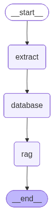

# Digital Border Control System

An AI-assisted border control system that automates traveler verification using passport image extraction, database tracking, and rule-based analysis using Retrieval Augmented Generation (RAG).

The system uses a **LangGraph agent pipeline** to process traveler information in sequential steps:

```
START → extract → database → rag → END
```



---

# Overview

The system simulates a **digital border checkpoint** where travelers can:

1. Enter a country
2. Exit a country
3. Retrieve previously stored traveler data

It performs:

* Passport information extraction from images
* Database logging of traveler movement
* Compliance verification against official border rules using RAG
* Interactive follow-up Q&A with the AI

---

# System Architecture

The pipeline is implemented using **LangGraph**.

Workflow:

1. **Extract Node**

   * Extract passport data from an uploaded image using a vision LLM.

2. **Database Node**

   * Store or retrieve traveler information from MongoDB.

3. **RAG Node**

   * Analyze traveler data against legal entry rules using a vector database.

Flow defined in `graph.py`: 

```python
graph = StateGraph(agentstate)

graph.add_node("extract", extract_node)
graph.add_node("database", db_node)
graph.add_node("rag", rag_node)

graph.add_edge(START, "extract")
graph.add_edge("extract", "database")
graph.add_edge("database", "rag")
graph.add_edge("rag", END)
```

---

# Core Components

## 1. Streamlit Interface

Main application interface.

File: `app.py` 

Responsibilities:

* Upload passport scans
* Input manual security data
* Trigger AI verification
* Display extracted passport information
* Provide AI chat interface for follow-up questions

Supported user actions:

```
enter
exit
retrieve
```

Manual security inputs include:

* Passport validity
* Visa status
* SEVIS status
* I-94 completion
* Customs clearance
* Biometrics capture

---

# 2. Agent State

The LangGraph pipeline passes a shared state object between nodes.

Defined in `nodes.py`: 

```python
class agentstate(TypedDict):
    person_id: str
    scanned_data: Dict
    db_data: Dict
    rag_response: str
    action: str
    manual_inputs: Dict
```

### State Fields

| Field         | Description                              |
| ------------- | ---------------------------------------- |
| person_id     | Unique identifier for traveler           |
| scanned_data  | Extracted passport data                  |
| db_data       | Retrieved database record                |
| rag_response  | Final AI decision                        |
| action        | Operation type (enter / exit / retrieve) |
| manual_inputs | Additional security inputs               |

---

# 3. Image Extraction

Passport data is extracted using **OpenAI vision models**.

File: `image_extract.py` 

### Process

1. Passport image is read
2. Converted to Base64
3. Sent to `gpt-4o-mini`
4. Structured output returned via Pydantic schema

### Extracted Fields

```
Type
Country_Code
Passport_No
Surname
Given_Name
DOB
POB
POI
DOI
DOE
```

The LLM is forced to return a structured schema using:

```python
model.with_structured_output(output_structure)
```

---

# 4. MongoDB Database Layer

Handles traveler entry, exit, and record retrieval.

File: `mongodb_connect.py` 

### Database

```
people_record
```

### Collections

| Collection  | Purpose                            |
| ----------- | ---------------------------------- |
| daily_entry | Travelers entering the country     |
| daily_exit  | Travelers leaving the country      |
| non_exit    | Foreign travelers currently inside |
| all-records | Permanent traveler history         |

---

### Entry Logic

When a traveler enters:

1. Insert record into `daily_entry`
2. If traveler is foreign:

   * Add to `non_exit`
   * Add to `all-records`

---

### Exit Logic

When traveler exits:

1. Insert record into `daily_exit`
2. If foreign traveler:

   * Remove from `non_exit`

---

### Record Structure

Each record contains:

```
person_id
passport_type
Country_Code
Passport_No
Surname
Given_Name
DOB
POB
POI
DOI
DOE
crime
passport_validity_time
visa_status
student_sevis_data
i94_form_completed
customs_declaration_completed
biometrics_captured
created_at
```

---

# 5. RAG Decision Engine

Traveler eligibility is evaluated using **Retrieval Augmented Generation**.

File: `RAG_rules.py` 

### Steps

1. Border rules PDF is loaded
2. Text split into chunks
3. Chunks embedded using OpenAI embeddings
4. Stored in FAISS vector database

```
text-embedding-3-small
```

---

### Retrieval

Top 20 relevant rule chunks are retrieved.

```
search_kwargs={"k": 20}
```

---

### AI Decision

The model (`gpt-4o`) receives:

```
Traveler information
+
Relevant legal rules
```

It returns:

```
1. Allow Entry
2. Deny Entry
3. Require Further Scrutiny
```

The response also cites **source page numbers**.

---

# 6. LangChain Tools

The system exposes functions as **LangChain tools**.

Defined in `tools.py` 

Tools available:

| Tool            | Purpose                       |
| --------------- | ----------------------------- |
| image_extractor | Extract passport fields       |
| enter           | Log traveler entry            |
| exit            | Log traveler exit             |
| retrieve_data   | Fetch traveler record         |
| rag_system      | Evaluate traveler using rules |

---

# Agent Nodes

Defined in `nodes.py` 

---

## Extract Node

```
extract_node()
```

Responsibilities:

1. Calls image extraction tool
2. Merges manual inputs
3. Saves result in state

Output:

```
state["scanned_data"]
```

---

## Database Node

```
db_node()
```

Behavior depends on action:

| Action   | Operation             |
| -------- | --------------------- |
| enter    | Insert traveler entry |
| exit     | Insert exit record    |
| retrieve | Fetch existing record |

---

## RAG Node

```
rag_node()
```

Passes traveler information to the RAG system for verification.

Output:

```
state["rag_response"]
```

---

# User Workflow

### Traveler Entry

1. Upload passport image
2. Enter additional verification inputs
3. Run AI verification

Pipeline:

```
extract → database(entry) → rag
```

---

### Traveler Exit

1. Upload passport
2. Record exit
3. Update database

Pipeline:

```
extract → database(exit) → rag
```

---

### Retrieve Traveler

1. Enter traveler ID
2. Fetch stored information
3. Ask AI follow-up questions

Pipeline:

```
database(retrieve) → rag
```

---

# Installation

### 1. Clone repository

```
git clone <repo-url>
cd digital-border-control
```

---

### 2. Install dependencies

```
pip install -r requirements.txt
```

Required libraries include:

```
streamlit
langchain
langgraph
pymongo
openai
faiss-cpu
python-dotenv
pydantic
```

---

### 3. Configure environment variables

Create `.env` file.

```
OPENAI_API_KEY=your_openai_key
MONGO_URI=your_mongodb_connection_string
```

---

### 4. Run application

```
streamlit run app.py
```

---

# Example System Flow

Traveler arrives at border.

1️. Passport uploaded
2️. AI extracts passport data
3️. Database records entry
4️. RAG checks legal rules
5️. System returns verdict

Example output:

```
Traveler: John Doe
Country: CAN

Analysis:
Passport valid
Visa valid
SEVIS N/A
No alerts found

Verdict:
Allow Entry (Source: Page 4)
```

---

# Key Technologies

| Technology    | Purpose                   |
| ------------- | ------------------------- |
| Streamlit     | Web interface             |
| LangGraph     | AI workflow orchestration |
| LangChain     | Tool integration          |
| OpenAI GPT-4o | Reasoning and analysis    |
| GPT-4o-mini   | Vision extraction         |
| FAISS         | Vector database           |
| MongoDB       | Traveler records          |

---

# Future Improvements

Possible enhancements:

* Real passport OCR fallback
* Facial verification
* Criminal database integration
* Multi-country rule support
* Audit logs for border decisions
* Real-time immigration dashboards


